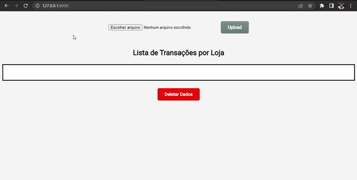

# Interpretador de dados CNAB

<br>

<h1>🏁 APRESENTAÇÃO</h1>

<br>

<p>O Interpretador de dados CNAB é uma aplicação desenvolvida em python que objetiva receber um arquivo com a extensão <i>.txt</i> contendo dados no padrão do Centro Nacional de Automação Bancária (CNAB), interpretar os dados e renderizá-los em tela, demonstrando o histórico de transações por loja. As informações apresentadas são: tipo da transação, data, cpf, cartão, hora, valores e saldo do estabelecimento. Além disso, na aplicação é possível deletar os dados, caso o usuário queira interpretar outro arquivo.</p>

<br>

<h1>💻 USO</h1>

<br>

<p>Para utilizar a aplicação basta rodá-la localmente, acessá-la no navegador, carregar um arquivo <i>.txt</i> contendo dados no padrão CNAB, clicar em upload e seus dados serão interpretados e renderizados em tela categorizados por loja. Também, no fim da tabela, existe o botão <i>Deletar Dados</i>, que remove as informações do banco de dados. É recomendável excluir uma tabela antes de carregar outro arquivo. No GIF é possível visualizar o funcionamento da aplicação</p>

<br>

<div style="display:flex; justify-content:center">

</div>

<br>

<h1>🔨 INSTALAÇÃO</h1>

<br>

<p>A aplicação pode ser executada em sua máquina local de 2 formas. Primeira, baixando ou fazendo clone do repositório e instalar as dependências manualmente ou, segunda, utilizando o Docker. As duas maneiras são abordadas.</p>

<br>

<h2>⚙ INSTALAÇÃO - Manual</h2>

<br>

<p>São requisitos para a instalação manual que existam previamente em sua máquina o <a href="https://www.python.org/downloads/"><strong>PYTHON</strong></a> e o gerenciador de pacotes <a href="https://pypi.org/project/pip/"><strong>PIP</strong></a>. Também é recomendável, mas não obrigatório, que na raiz do projeto esteja ativo algum ambiente virtual para que as dependências do projeto não sejam instaladas globalmente em sua máquina. </p>

<br>

<p>Cumpridas essas recomendações, acesse a raiz do projeto e rode no terminal o seguinte comando:</p>

<br>

```shell
pip install -r requirements.txt
```

<br>

<p>Após instaladas as dependências do projeto, pode rodar o servidor:</p>

<br>

```shell
python manage.py runserver
```

<br>

<p>Não se preocupe em criar e gerar migrações, elas já estão prontas no banco de dados relacional sqlite3 que acompanha o projeto.</p>

<p>Após executar o servidor, basta abrir a porta apontada por ele, sendo por padrão: <a href="http://127.0.0.1:8000/">http://127.0.0.1:8000/</a> </p>

<br>

<h2>🐳 INSTALAÇÃO - Docker</h2>

<br>

<p>Para executar o aplicativo em um container, o requisito é ter previamente o <a href="https://docs.docker.com/desktop/"><strong>DOCKER</strong></a> instalado e configurado em sua máquina. Assim, basta rodar o seguinte comando na raiz do projeto:</p>

<br>

```shell
docker-compose up
```

<br>

<p>Ao fim da montagem da imagem e a execução do container, basta acessar a porta indicada por ele ou uma das seguintes: <a href="http://127.0.0.1:8000/">http://127.0.0.1:8000/</a> ou <a href="http://0.0.0.0:8000/">http://0.0.0.0:8000/</a>. Caso a porta apresentada pelo container não rode, tente uma das indicadas.</p>

<br>

<h1>🧾 ARQUIVO COM DADOS CNAB NO FORMATO .TXT</h1>

<br>

<p>É fundamental que sejam utilizados dados no padrão CNAB em um arquivo <i>.txt</i> para que a aplicação funcione. <a href="https://github.com/Kenzie-Academy-Brasil-Developers/desafio-backend-m6/blob/main/CNAB.txt">Nesse Link</a> existem informações no padrão indicado. Basta copiar os dados e salvar no bloco de notas ou outro editor de texto no formato indicado</p>

<br>

<h1>🚀 TECNOLOGIAS</h1>
<ul>
<li>PYTHON</li>
<li>DJANGO</li>
<li>TEMPLATES DJANGO</li>
<li>PYTZ</li>
<li>SQLITE3</li>
<li>DOCKER</li>
</ul>
